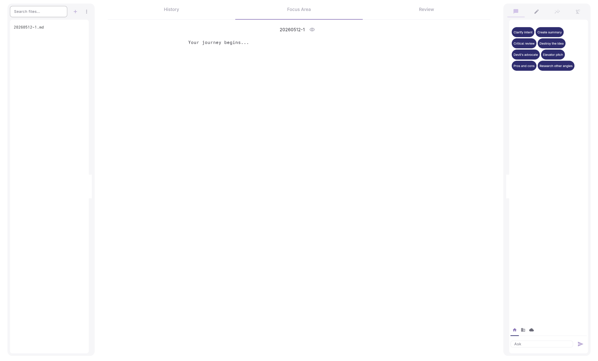
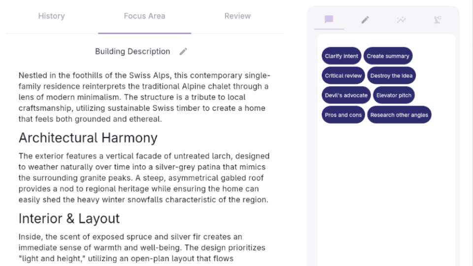
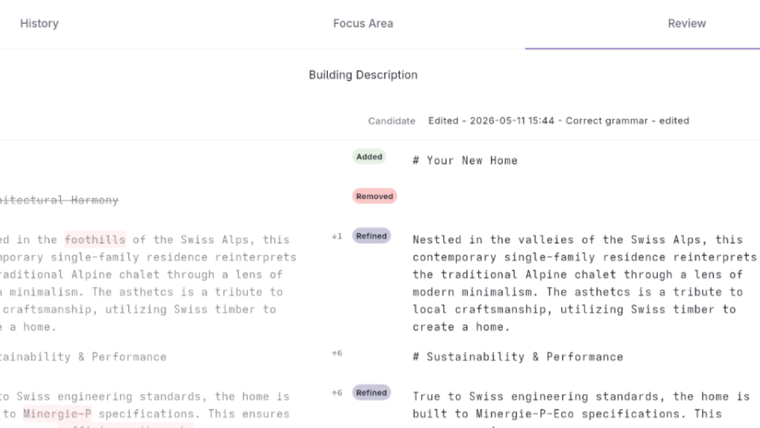
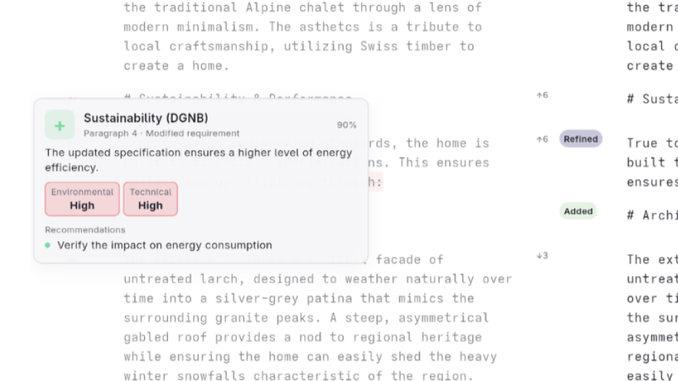

# iterthink

**See every change. Understand the impact. Act on what matters.**



AI edits are silent by default. You see the result, never the delta. iterthink makes the delta visible — word by word — and tells you whether the meaning survived and how it impacts the text.

---

## What iterthink does

iterthink is the desktop first review layer for documents. It covers three distinct workflows — each one building on the last.

---

### 1. Write and see what changed




Every edit is captured. Every version is stored. Compare any two states of a document side by side — word-level highlights, not just line diffs. Paragraphs that moved are tracked as moved, not deleted and reinserted. Nothing gets lost silently.

- Word-level inline diff — additions and deletions highlighted inline
- Compare any two versions at any time
- Paragraph-level change classification (per new paragraph slot) in the compare column with: — · Refined · Modified · Rephrased · Added · Removed
- Full version timeline — every save, every AI action


---

### 2. Optimize with AI — and see exactly what changed



Run predefined prompts on any paragraph. Discuss, rewrite, shorten, translate — then see precisely what the AI changed before you accept it. You stay in control of every word.

- Margin actions on individual paragraphs (Discuss / Edit / Evaluate)
- Predefined prompt templates via `prompts.yaml` — customizable per project or team
- Word-level diff between your original and the AI version, shown inline
- Accept, reject, or edit — nothing is applied without your decision
- Every AI action auto-saves a version snapshot

**AI backends:** Ollama (local, private, default) · OpenAI · Anthropic · Google Gemini · Any OpenAI-compatible endpoint

---

### 3. Evaluate the impact of the change



Not all changes are equal. iterthink uses local embeddings and an LLM tiebreak to classify whether a paragraph change was cosmetic or substantive — without sending your documents to a cloud service.

Cosine similarity on local embeddings handles the clear cases fast. The LLM is only called in the uncertain band — minimizing cost and latency while maximizing accuracy.

This is the judgment layer. It tells you not just *what* changed, but *whether it matters*.

When a change matters, trigger a follow-up workflow directly through [{yourcompany}os](https://yourcompanyos.io).

---

## Who it's for

- **AEC and spec teams** — track changes in technical documents, catch contradictions across specs, trigger approval workflows when something meaningful shifts
- **Writers and editors** — protect your voice when using AI assistance; see exactly what changed and whether your point survived
- **Researchers and journalists** — maintain a clear record of how a document evolved; verify that AI edits stayed on point
- **Anyone who has opened `final_final_v7.docx`** and wondered what happened

---

## Get started

### Prebuilt installers ([latest release](https://github.com/simondilhas/iterthink/releases/latest))

Download the matching asset from the release page:

- `iterthink-0.0.3-windows-installer.exe` (tested, unsigned)
- `iterthink-0.0.3-fedora-x86_64.rpm` (tested)
- `iterthink-0.0.3-linux-x86_64.AppImage` (tested)
- `iterthink-0.0.3-macos.dmg` (untested, unsigned)


### Install from GitHub (pip)

Prerequisites: Python 3.11+ · an AI backend (local Ollama or a cloud API key)

Install from [GitHub](https://github.com/simondilhas/iterthink) (latest default branch: `main`).

**Linux and macOS** (bash/zsh — Terminal, iTerm, etc.):

```bash
python3 -m venv .venv && source .venv/bin/activate
pip install -U pip
pip install "git+https://github.com/simondilhas/iterthink.git"
iterthink
```

**Windows** (Command Prompt or PowerShell):

```bat
py -3.11 -m venv .venv
.\.venv\Scripts\activate
pip install -U pip "git+https://github.com/simondilhas/iterthink.git"
iterthink
```

**First launch:**
1. Go to **File → Settings → Paths** — point it to your documents folder (default store is `Documents/.iterthink`)
2. Go to **Settings → Models** — choose your AI backend and configure it
3. **Paragraph compare:** the app downloads a local ONNX embedding model (~0.35 GB) from Hugging Face into your store folder on first launch; stay online once (set `HF_TOKEN` if your network requires it). GitHub desktop installers behave the same way.

**AI backend options:**

| Backend | Setup |
|---|---|
| **Ollama** (local, private) | Install [Ollama](https://ollama.com), run `ollama pull llama3.2`, set host in Settings → Models |
| **OpenAI / ChatGPT** | Paste API key in Settings → Models |
| **Anthropic / Claude** | Paste API key in Settings → Models |
| **Google / Gemini** | Paste API key in Settings → Models |

**Where data lives:** settings under your OS config path (`~/.config/iterthink` on Linux, `~/Library/Application Support/iterthink` on macOS, `%APPDATA%\iterthink` on Windows); documents and the local database under `Documents/.iterthink`.

**From a clone (editable):** `git clone https://github.com/simondilhas/iterthink.git`, then `pip install -e .`, then `iterthink` or `python -m iterthink`.

### App menu (pip install)

`pip` does not register an OS launcher. Add one if you want iterthink in the system menu, not only from a terminal.

**Linux** (GNOME, KDE, and other Freedesktop desktops): Activate the same environment you use for `iterthink`, run `which iterthink`, then create `~/.local/share/applications/iterthink.desktop` with that path in `Exec=`:

```ini
[Desktop Entry]
Type=Application
Name=Iterthink
Exec=/ABSOLUTE/PATH/TO/iterthink
Icon=applications-office
Terminal=false
Categories=Office;TextEditor;
```

If the entry does not show up, run `update-desktop-database ~/.local/share/applications/`, then search the app grid / Activities for **Iterthink**.

**Windows:** Shortcut → target `...\your-project\.venv\Scripts\iterthink.exe`, or the `iterthink.exe` under `%USERPROFILE%\AppData\Roaming\Python\` if you used `pip install --user`. Put the `.lnk` in `%APPDATA%\Microsoft\Windows\Start Menu\Programs\` for Start; pin to the taskbar from there if you want.

---

## Prompts (margin actions)

Per-paragraph AI actions are defined in `prompts.yaml` in your store folder.

| | |
|---|---|
| **Runtime file** | `<store_dir>/prompts.yaml` — find your `store_dir` under **File → Settings → Paths** |
| **First install** | Created automatically from package defaults |
| **In the app** | **File → Settings → Prompts** — add rows, edit system prompt and user template (`{text}` is replaced with the paragraph) |
| **By hand** | Valid YAML with a top-level `margin_actions:` list. Each entry needs `id`, `label`, `topic` (`discuss`, `change`, or `evaluate`), `system_prompt`, and `user_template` |

**App upgrades:** On startup, new bundled margin actions are added to your store file automatically. If a bundled action you already have changes in a new release, Iterthink shows a review dialog (yours vs new default) — nothing is overwritten until you choose **Use new default**. Removed bundled actions stay removed.

---

## Why local

No cloud. No account. No API key required. Your files stay on your machine. The AI runs locally via Ollama — private by default, not by policy.

Using a cloud API key (OpenAI, Anthropic, Gemini) sends your text to that provider. Ollama sends nothing.

---

## Roadmap (not in order)

-[x] Refracture MarkdownStudio. Code is too complicated.
-[ ] Evaluate not only change, but consistency against other files (RAG functionality)
-[ ] Compare Excel sheets
-[ ] Compare PDF Plans (Floorplans, Sections)
-[ ] IFC model comparison — see what changed between two BIM model versions
-[x] Linux, Windows and macOS installers (started, signing of installers and testing)[]
-[ ] signing of macOS und windows installer
-[ ] Sync and version history across devices
-[ ] Team review features for collaborative workflows
-[ ] Deeper [{yourcompany}os](https://yourcompanyos.io) integration — from change detection to closed decisions
-[ ] Redesign with Dart (instead of python and flet) for better performance.

---

## Part of the Abstract platform

iterthink is the review layer. It sits between your documents and your decisions.

| | |
|---|---|
| [Abstract BIM](https://abstractbim.com) | Normalize architectural BIMs for ML, quantity takeoff or simulations |
| [Pragmatic BIM](https://pragmaticbim.com) | Define BIM requirements |
| **iterthink** | Detect change, evaluate impact |
| [{yourcompany}os](https://yourcompanyos.io) | Act on change |

Raw data means nothing until it's clean, defined, reviewed, and acted on.

---

## Status

This is early software. Defaults and behavior may change between releases.

- **Platform:** Primarily developed and tested on **Fedora Linux**. Windows and macOS may work but are not regularly QA'd — [open an issue](https://github.com/simondilhas/iterthink/issues) if something breaks.
- **AI backend:** Ollama is the most tested backend. OpenAI, Claude, and Gemini work but get less QA.
- **Privacy:** Local-first by default — no account, no cloud sync, files stay on your disk. Using a cloud API key sends your text to that provider.

---

## Pricing

For **commercial work** — team deployment, commercial licensing, and related options — see **[iterthink.com — Pricing](https://www.iterthink.com/#pricing)**.

---

## License

Source available under [BUSL-1.1](https://mariadb.com/bsl11/).

- **Free for individual, non-commercial use** — see [LICENSE](LICENSE)
- **Commercial use** → [Pricing & commercial licensing](https://www.iterthink.com/#pricing); contact [Abstract AG](mailto:info@abstract.build)
- Converts to **Apache 2.0** on 2030-05-05
- **Third-party open-source** — see [THIRD_PARTY_NOTICES.md](THIRD_PARTY_NOTICES.md) (regenerate with `python scripts/generate_third_party_notices.py` before release)

---

**Contributing:** see [CONTRIBUTING.md](CONTRIBUTING.md) · **Issues:** [github.com/simondilhas/iterthink/issues](https://github.com/simondilhas/iterthink/issues)

---

*iterthink — the review layer for documents and models.*